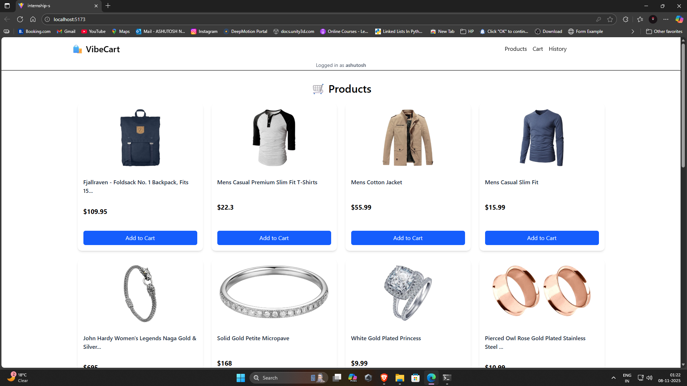
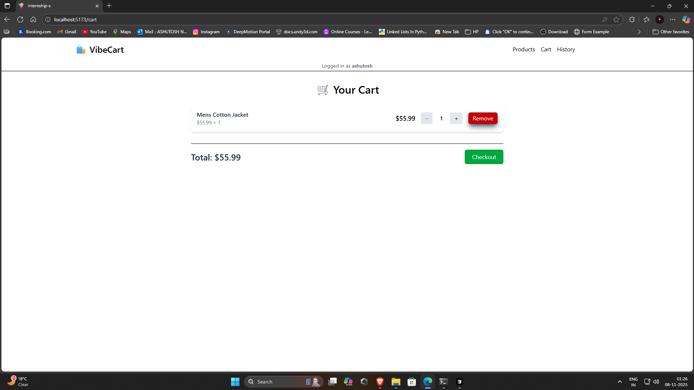
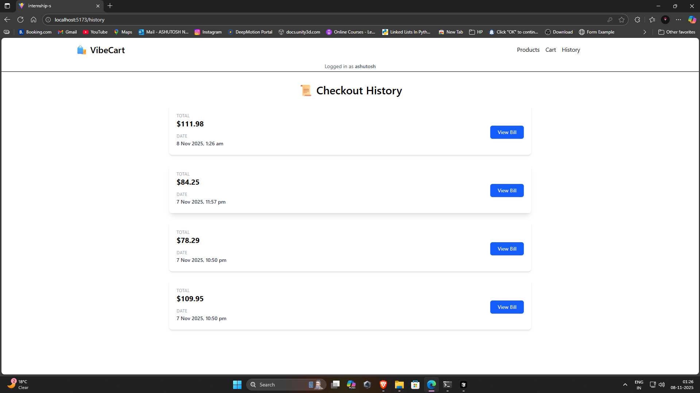

# 🛍️ VibeCart - E-Commerce Shopping Cart

> **Full Stack Internship Assignment** - Mock E-Commerce Cart Application

A complete shopping cart application built with React, Node.js, Express, and MongoDB demonstrating e-commerce fundamentals.

## 📸 Screenshots

- Product grid with "Add to Cart" buttons

- Shopping cart with items and quantity controls

- Checkout modal with receipt
- Order history page

## 🎥 Demo Video

[E-commerce Card Application Overview 🛒 - Watch Video](https://loom.com/share/4a4c7cf3837d40e082710cab4de6a90c)

## ✨ Features Implemented

### ✅ Core Requirements
- **Product Catalog**: Browse products from FakeStore API
- **Cart Management**: Add, update quantity, and remove items
- **Checkout System**: Mock checkout with receipt generation (total + timestamp)
- **Responsive Design**: Mobile-first UI with Tailwind CSS

### ✅ Bonus Features
- **Database Persistence**: MongoDB with user-based cart storage
- **Order History**: View past checkouts with detailed invoices
- **Error Handling**: Comprehensive error messages and validation
- **External API Integration**: FakeStore API for product data

## 🛠️ Tech Stack

**Frontend:**
- React 19 + Vite
- React Router DOM 7
- Tailwind CSS 4
- Axios

**Backend:**
- Node.js + Express 5
- MongoDB + Mongoose 8
- CORS enabled
- REST API architecture

## 🚀 Quick Setup

### Prerequisites
```bash
Node.js v18+
MongoDB (local or Atlas)
```

### Installation

1. **Clone Repository**
   ```bash
   git clone https://github.com/ashutoshnegi120/Mock-E-Com-Cart.git
   ```

2. **Backend Setup**
   ```bash
   cd backend
   npm install
   ```
   
   Create `.env` file:
   ```env
   MONGO_URI=mongodb://localhost:27017/vibecart (local env)
   PORT=8080
   ```
   
   Start server:
   ```bash
   npm run dev
   # Server runs on http://localhost:8080
   ```

3. **Frontend Setup**
   ```bash
   cd frontend
   npm install
   npm run dev
   # App runs on http://localhost:5173
   ```

4. **Access Application**
   - Open browser: `http://localhost:5173`
   - Enter your name when prompted
   - Start shopping!

## 📡 API Endpoints

| Method | Endpoint | Description |
|--------|----------|-------------|
| POST | `/api/addCart` | Add item to cart |
| GET | `/api/getAll/:user` | Get user's cart |
| POST | `/api/updateQuantity/:user/:id/:action` | Update quantity |
| DELETE | `/api/removeItem/:user/:id/:quantity` | Remove item |
| POST | `/api/checkOut/:user` | Complete checkout |
| GET | `/api/checkoutHistory/:user` | Get order history |

**External API:** `https://fakestoreapi.com/products`

## 📂 Project Structure

```
vibecart/
├── backend/
│   ├── Controller/         # Route handlers
│   ├── Model/             # MongoDB schemas
│   ├── Database/          # DB connection
│   ├── Routers/           # API routes
│   └── index.js           # Server entry
│
├── frontend/
│   ├── src/
│   │   ├── components/    # Reusable components
│   │   ├── page/          # Page components
│   │   ├── api/           # Axios configuration
│   │   ├── hooks/         # Custom hooks
│   │   └── App.jsx        # Root component
│   └── public/
│
└── README.md              # This file
```

## 🎯 Assignment Completion Checklist

- [x] Backend APIs (GET products, POST/DELETE cart, GET cart, POST checkout)
- [x] Frontend Products Grid with "Add to Cart"
- [x] Cart View with items/quantity/total/remove buttons
- [x] Checkout with name/email → receipt modal
- [x] Responsive Design
- [x] Database Persistence (MongoDB)
- [x] Error Handling
- [x] FakeStore API Integration
- [x] GitHub Repository with proper structure
- [x] README with setup instructions
- [x] Demo Video

## 🔑 Key Implementation Details

### Database Schema
- **Cart Model**: Stores user cart with items, quantities, and auto-calculated totals
- **Checkout Model**: Records completed orders with references to cart items

### User Management
- Simple localStorage-based user identification
- No authentication required for assignment scope
- User prompt on first visit

### Cart Logic
- Real-time quantity updates (increase/decrease)
- Auto-remove when quantity reaches 0
- Total price auto-calculation via Mongoose hooks
- Cart persists in MongoDB across sessions

### Checkout Flow
```
Add Items → Update Quantities → Checkout → 
Receipt Modal → Cart Cleared → Order Saved to History
```

## 🧪 Testing the Application

1. **Product Browsing**: Click any product for details
2. **Add to Cart**: Click "Add to Cart" on multiple products
3. **Cart Management**: 
   - Navigate to Cart page
   - Use +/- buttons to adjust quantities
   - Click Remove to delete items
4. **Checkout**: Click "Checkout" button
5. **View History**: Check History page for past orders
6. **View Invoice**: Click "View Bill" on any order

## 📝 Additional Notes

### Time Investment
- Backend API Development: ~4 hours
- Frontend Components & Pages: ~6 hours
- Database Integration: ~2 hours
- Styling & Responsive Design: ~3 hours
- Testing & Bug Fixes: ~2 hours
- **Total: ~17 hours**

### Challenges Solved
1. Auto-calculating cart totals with Mongoose pre-save hooks
2. Handling quantity updates without full page refresh
3. Proper cart state management across components
4. Invoice modal with product details from populated references

### Future Enhancements (Beyond Assignment)
- User authentication with JWT
- Product search and filtering
- Payment gateway integration
- Admin dashboard for product management

## 👤 Author

**Ashutosh**

## 📞 Contact

For any questions about this assignment submission:
- GitHub: [https://github.com/ashutoshnegi120]
- Email: [ashutoshnegisgrr@gmail.com]

## 📄 License

ISC License - Created for Vibe Commerce Internship Assignment

---

**Submission Date**: November 8, 2025 2:00 AM
**Assignment Deadline**: November 8, 2025

---

### For Detailed Documentation:
- [Backend Documentation](./backend/README.md)
- [Frontend Documentation](./frontend/README.md)
